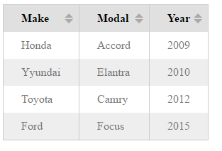

# sort-table
a table component support sorting feature

## Demo
:rocket: [check it out](http://jsbin.com/gofogo/edit?html,css,js,output) ~

## Usage
Just new `Table` class, and pass an option object

```javascript
const table = new Table({
  data: [
    ['Make', 'Modal', 'Year'],
    ['Honda', 'Accord', '2009'],
    ['Yyundai', 'Elantra', '2010'],
    ['Toyota', 'Camry', '2012'],
    ['Ford', 'Focus', '2015']
  ],
  root: document.querySelector('main'),
  theme: 'striped',
  sortable: true
})
```

## Options
#### data
The table's data, **must 2d Array**. The first item is *table heading*.

- type: `array`
- value: any valid 2d array
- default: `[]`

#### root
Specify the container of the table

- type: `DOM ELEMENT`
- value: any valid DOM element
- default: `document.body`

#### sortable
If true, show the sortable toolbar so that you can click it and sort the data

- type: `boolean`
- value: `true / false`
- default: `true`

#### theme
There is 3 themes for the table component

- type: `string`
- value: `''` / `bordered` / `striped`
- default: `''`

`''` means the basic theme

## Screenshot

